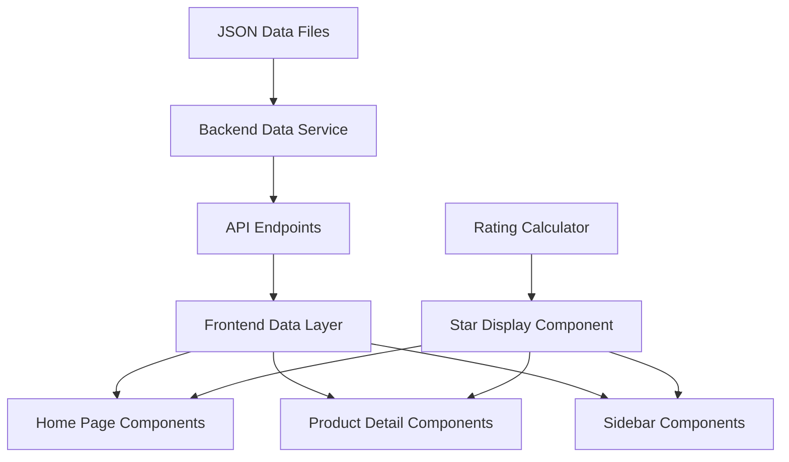
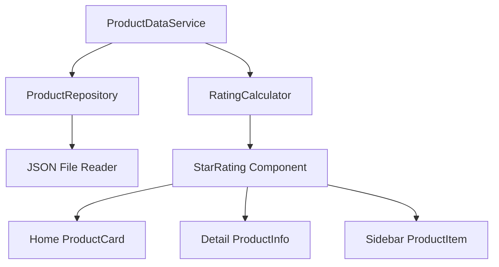

# Design Document

## Overview

This design addresses the inconsistencies in star rating display and data synchronization across the product review system. The solution centralizes data management through a unified data access layer that uses JSON files as the single source of truth, while implementing proper star rating visualization that accurately represents decimal ratings including half-stars.

## Architecture

### Data Flow Architecture



### Component Architecture



## Components and Interfaces

### 1. Backend Data Service Layer

#### ProductDataService
- **Purpose**: Centralized data access and management
- **Responsibilities**:
  - Load and parse JSON product data
  - Calculate aggregated ratings and review counts
  - Provide consistent data models
  - Abstract data source for future DynamoDB migration

#### ProductRepository
- **Purpose**: Data persistence abstraction layer
- **Responsibilities**:
  - Read/write operations to JSON files
  - Data validation and schema enforcement
  - Error handling for file operations

### 2. Frontend Data Layer

#### ProductApiService
- **Purpose**: Frontend API communication layer
- **Responsibilities**:
  - Fetch product data from backend
  - Cache product data for performance
  - Handle API errors gracefully

#### RatingCalculator
- **Purpose**: Consistent rating calculations across components
- **Responsibilities**:
  - Calculate average ratings from review arrays
  - Round ratings to nearest 0.5 for display
  - Generate rating statistics

### 3. UI Components

#### StarRating Component
- **Purpose**: Reusable star rating display component
- **Props**:
  - `rating: number` - The decimal rating value
  - `size?: 'small' | 'medium' | 'large'` - Display size
  - `showCount?: boolean` - Whether to show review count
  - `reviewCount?: number` - Number of reviews
- **Features**:
  - Accurate half-star display
  - Responsive sizing
  - Accessibility support

#### Enhanced ProductCard Component
- **Purpose**: Consistent product display for home page
- **Features**:
  - Uses centralized data source
  - Displays accurate star ratings
  - Shows consistent review counts

## Data Models

### Enhanced Product Model

```typescript
interface Product {
  id: string;
  name: string;
  category: string;
  seller_id: string;
  price: number;
  description: string;
  image_url: string;
  features: string[];
  reviews: Review[];
  // Calculated fields
  averageRating: number;
  reviewCount: number;
  ratingDistribution: RatingDistribution;
}

interface RatingDistribution {
  1: number;
  2: number;
  3: number;
  4: number;
  5: number;
}

interface Review {
  id: string;
  user_name: string;
  rating: number;
  content: string;
  date: string;
  verified_purchase: boolean;
  keywords?: string[];
  sentiment?: SentimentAnalysis;
  analysis_completed?: boolean;
  analysis_timestamp?: string;
  seller_response?: SellerResponse;
  agent_log_id?: string;
}
```

### Frontend Product Models

```typescript
interface ProductSummary {
  id: string;
  name: string;
  category: string;
  price: number;
  averageRating: number;
  reviewCount: number;
  image_url: string;
  emoji: string;
}

interface ProductDetail extends ProductSummary {
  description: string;
  features: string[];
  reviews: Review[];
  ratingDistribution: RatingDistribution;
}
```

## Error Handling

### Backend Error Handling
- **File Not Found**: Return empty product array with appropriate logging
- **JSON Parse Errors**: Log error and return cached data if available
- **Data Validation Errors**: Log validation failures and sanitize data

### Frontend Error Handling
- **API Failures**: Show user-friendly error messages with retry options
- **Missing Data**: Display placeholder content with loading states
- **Rating Calculation Errors**: Default to 0 rating with appropriate messaging

## Testing Strategy

### Unit Tests
- **RatingCalculator**: Test rating calculations and rounding logic
- **StarRating Component**: Test star display for various rating values
- **ProductDataService**: Test data loading and transformation
- **ProductRepository**: Test JSON file operations

### Integration Tests
- **API Endpoints**: Test data consistency between endpoints
- **Component Integration**: Test data flow from API to UI components
- **Cross-Page Consistency**: Test that same product shows identical data across pages

### Test Cases for Star Rating
```typescript
describe('StarRating Component', () => {
  test('displays 3.5 rating as 3 full stars and 1 half star', () => {
    // Test implementation
  });
  
  test('displays 4.0 rating as 4 full stars and 0 half stars', () => {
    // Test implementation
  });
  
  test('displays 4.7 rating as 4 full stars and 1 half star (rounded to 4.5)', () => {
    // Test implementation
  });
});
```

## Performance Considerations

### Data Caching
- **Backend**: Implement in-memory caching for JSON data with file change detection
- **Frontend**: Cache API responses with appropriate TTL
- **Component Level**: Memoize expensive calculations like rating aggregations

### Optimization Strategies
- **Lazy Loading**: Load detailed product data only when needed
- **Data Prefetching**: Preload commonly accessed products
- **Component Memoization**: Prevent unnecessary re-renders of rating components

## Migration Path to DynamoDB

### Phase 1: JSON File Abstraction
- Implement repository pattern with JSON backend
- Create consistent data models
- Establish API contracts

### Phase 2: DynamoDB Integration
- Replace JSON file operations with DynamoDB calls
- Maintain same API contracts
- Implement data migration scripts

### Phase 3: Advanced Features
- Real-time updates with DynamoDB Streams
- Advanced querying capabilities
- Scalable caching with ElastiCache

## Implementation Phases

### Phase 1: Backend Data Centralization
1. Create ProductDataService with JSON file reading
2. Implement rating calculation logic
3. Update API endpoints to use centralized service
4. Add comprehensive error handling

### Phase 2: Frontend Data Layer
1. Create ProductApiService for API communication
2. Implement RatingCalculator utility
3. Add data caching mechanisms
4. Update existing components to use new data layer

### Phase 3: Star Rating Component
1. Create reusable StarRating component
2. Implement accurate half-star display logic
3. Add accessibility features
4. Create comprehensive test suite

### Phase 4: Component Integration
1. Update ProductDetail component to use new data layer
2. Update home page components to use centralized data
3. Update sidebar components for consistency
4. Implement cross-component data synchronization

### Phase 5: Testing and Validation
1. Implement unit tests for all new components
2. Add integration tests for data flow
3. Perform cross-browser testing for star display
4. Validate data consistency across all views