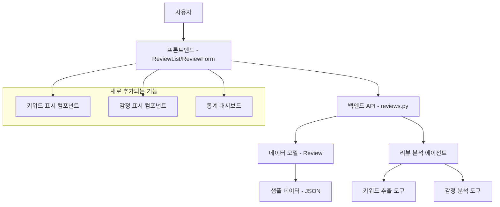

# 설계 문서

## 개요

리뷰 시스템에 핵심 키워드 추출과 감정 분석 기능을 추가하는 설계입니다. 기존 리뷰 분석 에이전트를 활용하여 새로운 필드를 추가하고, 프론트엔드에서 시각적으로 표시하며, 샘플 데이터를 업데이트하여 일관된 사용자 경험을 제공합니다.

## 아키텍처

### 전체 시스템 구조



### 데이터 흐름

1. **신규 리뷰 작성 시**:
   - 사용자가 리뷰 작성 → API 호출 → 리뷰 저장
   - 백그라운드에서 분석 에이전트 실행 → 키워드/감정 추출
   - 분석 결과를 리뷰 데이터에 업데이트

2. **리뷰 목록 표시 시**:
   - API에서 리뷰 데이터 조회 → 키워드/감정 포함
   - 프론트엔드에서 시각적으로 렌더링

## 컴포넌트 및 인터페이스

### 1. 데이터 모델 확장

**기존 Review 모델에 추가할 필드:**

```python
class Review(BaseModel):
    # 기존 필드들...
    id: str
    user_name: str
    rating: int
    content: str
    date: str
    verified_purchase: bool = True
    auto_response: Optional[str] = None
    response_approved: bool = False
    
    # 새로 추가되는 필드들
    keywords: Optional[List[str]] = None
    sentiment: Optional[Dict[str, Any]] = None
    analysis_completed: bool = False
```

**감정 분석 데이터 구조:**
```python
sentiment = {
    "label": "긍정|부정|중립",
    "confidence": 0.85,  # 0-1 사이의 신뢰도
    "polarity": 0.7      # -1(부정) ~ 1(긍정)
}
```

### 2. API 엔드포인트 수정

**기존 엔드포인트 확장:**
- `GET /products/{product_id}/reviews`: 키워드/감정 데이터 포함하여 반환
- `POST /products/{product_id}/reviews`: 리뷰 생성 후 분석 트리거

**새로운 엔드포인트:**
- `GET /products/{product_id}/reviews/analytics`: 리뷰 통계 및 키워드 빈도 분석

### 3. 프론트엔드 컴포넌트 설계

#### ReviewList 컴포넌트 확장

**키워드 표시 영역:**
```tsx
interface KeywordTagProps {
  keywords: string[];
  onKeywordClick?: (keyword: string) => void;
}

const KeywordTags: React.FC<KeywordTagProps> = ({ keywords, onKeywordClick }) => {
  return (
    <div className="flex flex-wrap gap-2 mt-2">
      {keywords.map((keyword, index) => (
        <span
          key={index}
          onClick={() => onKeywordClick?.(keyword)}
          className="bg-blue-100 text-blue-800 text-xs px-2 py-1 rounded-full cursor-pointer hover:bg-blue-200"
        >
          #{keyword}
        </span>
      ))}
    </div>
  );
};
```

**감정 표시 영역:**
```tsx
interface SentimentIndicatorProps {
  sentiment: {
    label: string;
    confidence: number;
  };
}

const SentimentIndicator: React.FC<SentimentIndicatorProps> = ({ sentiment }) => {
  const getColorClass = (label: string) => {
    switch (label) {
      case '긍정': return 'bg-green-100 text-green-800';
      case '부정': return 'bg-red-100 text-red-800';
      default: return 'bg-gray-100 text-gray-800';
    }
  };

  return (
    <div className={`inline-flex items-center px-2 py-1 rounded-full text-xs ${getColorClass(sentiment.label)}`}>
      <span className="mr-1">
        {sentiment.label === '긍정' ? '😊' : sentiment.label === '부정' ? '😞' : '😐'}
      </span>
      {sentiment.label} ({Math.round(sentiment.confidence * 100)}%)
    </div>
  );
};
```

#### 통계 대시보드 컴포넌트

```tsx
interface ReviewAnalyticsProps {
  reviews: Review[];
}

const ReviewAnalytics: React.FC<ReviewAnalyticsProps> = ({ reviews }) => {
  // 키워드 빈도 계산
  // 감정 분포 계산
  // 시각적 차트 렌더링
};
```

## 데이터 모델

### Review 모델 확장

```python
class Review(BaseModel):
    id: str
    user_name: str
    rating: int
    content: str
    date: str
    verified_purchase: bool = True
    auto_response: Optional[str] = None
    response_approved: bool = False
    
    # 새로 추가되는 분석 데이터
    keywords: Optional[List[str]] = None
    sentiment: Optional[Dict[str, Any]] = None
    analysis_completed: bool = False
    analysis_timestamp: Optional[str] = None
```

### 샘플 데이터 구조 예시

```json
{
  "id": "REV-001",
  "user_name": "김**",
  "rating": 5,
  "content": "음질이 정말 좋아요! 노이즈 캔슬링 기능도 훌륭하고 배터리도 오래 갑니다. 강력 추천합니다!",
  "date": "2024-01-15",
  "verified_purchase": true,
  "keywords": ["음질", "노이즈캔슬링", "배터리", "추천"],
  "sentiment": {
    "label": "긍정",
    "confidence": 0.92,
    "polarity": 0.8
  },
  "analysis_completed": true,
  "analysis_timestamp": "2024-01-15T10:30:00Z"
}
```

## 오류 처리

### 분석 실패 시나리오

1. **네트워크 오류**: 분석 서비스 연결 실패
2. **텍스트 처리 오류**: 특수 문자나 인코딩 문제
3. **에이전트 오류**: AI 모델 응답 실패

### 오류 처리 전략

```python
async def analyze_review_with_fallback(review_text: str, review_id: str):
    try:
        # 메인 분석 시도
        result = await analyze_review(review_text)
        return result
    except Exception as e:
        # 폴백: 기본 분석 수행
        logger.error(f"Review analysis failed for {review_id}: {e}")
        return {
            "keywords": extract_simple_keywords(review_text),
            "sentiment": {"label": "중립", "confidence": 0.5},
            "analysis_completed": False,
            "error": str(e)
        }
```

### 프론트엔드 오류 처리

```tsx
const ReviewItem = ({ review }) => {
  const hasAnalysis = review.analysis_completed && review.keywords && review.sentiment;
  
  return (
    <div>
      {/* 기본 리뷰 내용 */}
      
      {hasAnalysis ? (
        <div>
          <KeywordTags keywords={review.keywords} />
          <SentimentIndicator sentiment={review.sentiment} />
        </div>
      ) : (
        <div className="text-gray-500 text-sm">
          분석 데이터를 불러오는 중...
        </div>
      )}
    </div>
  );
};
```

## 테스트 전략

### 1. 단위 테스트

**백엔드 테스트:**
- 키워드 추출 함수 테스트
- 감정 분석 함수 테스트
- API 엔드포인트 테스트

**프론트엔드 테스트:**
- 키워드 태그 컴포넌트 렌더링 테스트
- 감정 표시기 컴포넌트 테스트
- 분석 데이터 없는 경우 처리 테스트

### 2. 통합 테스트

- 리뷰 작성 → 분석 → 표시 전체 플로우 테스트
- 기존 샘플 데이터와 새 분석 데이터 호환성 테스트
- 분석 실패 시 폴백 동작 테스트

### 3. 성능 테스트

- 대량 리뷰 데이터 로딩 성능
- 분석 처리 시간 측정
- 프론트엔드 렌더링 성능

## 구현 우선순위

### Phase 1: 기본 구조
1. Review 모델 확장
2. 샘플 데이터 업데이트
3. 기본 키워드/감정 표시 UI

### Phase 2: 분석 기능
1. 리뷰 분석 에이전트 통합
2. 백그라운드 분석 처리
3. 오류 처리 및 폴백

### Phase 3: 고급 기능
1. 통계 대시보드
2. 키워드 필터링
3. 감정 기반 정렬

## 보안 고려사항

1. **입력 검증**: 리뷰 텍스트 XSS 방지
2. **API 보안**: 분석 결과 조작 방지
3. **데이터 무결성**: 분석 데이터 검증

## 성능 최적화

1. **지연 로딩**: 분석 데이터 필요 시에만 로드
2. **캐싱**: 분석 결과 캐싱으로 중복 처리 방지
3. **배치 처리**: 여러 리뷰 동시 분석